# Wireshark Network Analysis Notes

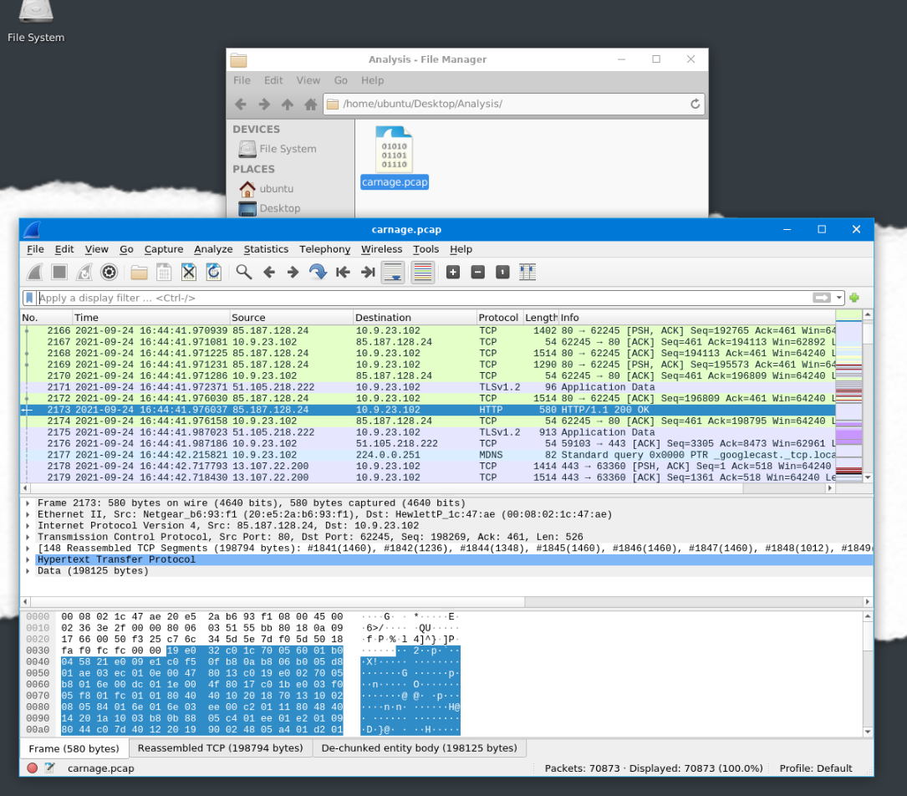

### Author
Emilio Shakhawat

### Carnage Challenge
This is my network analysis of the Carnage challenge on TryHackMe.com:

The scenario is as follows: an employee opened an email from a known contact, which contained a Word document that injected malicious code into the victim’s device. The security team managed to capture the packets during the time frame of the attack. My job is to assess and uncover the malicious activities.

### Finding the Origin Point of the Breach

I started by finding information on the origin point of the breach, specifically the first HTTP connection to the malicious IP.

Filtering the log with “http”, the first result shows a GET request to download a zip file.

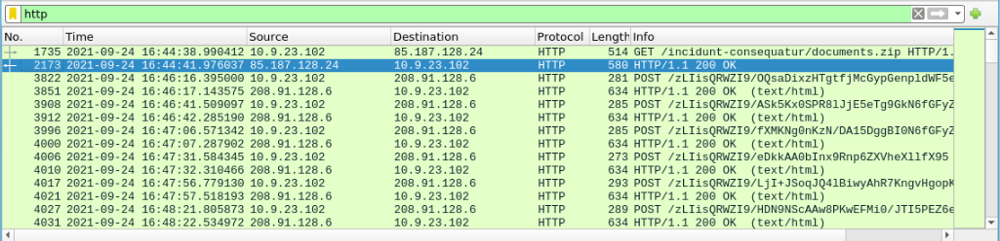

From this information:
- **Timestamp**: 2021-09-24 16:44:38
- **File Downloaded**: Document.zip

Following the HTTP stream reveals more details about the malicious connection.

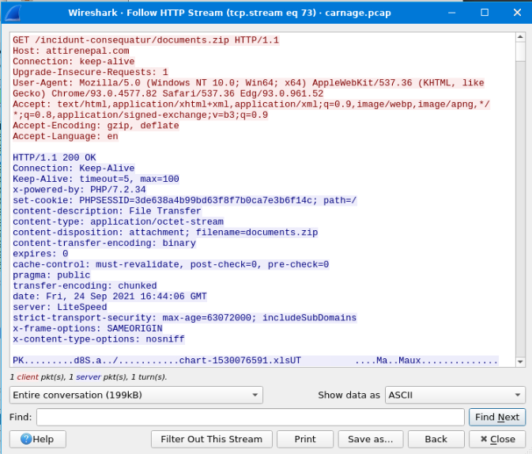

- **Timestamp**: 2021-09-24 16:44:38
- **File Downloaded**: Document.zip
- **Domain Host**: attirenepal.com
- **File in the Zip**: chart-1530076591.xls
- **Webserver Used**: LiteSpeed PHP/7.2.34

### Investigating Further Malicious Files

THM hints that more malicious files were downloaded within a specific time frame under HTTPS traffic. Since HTTPS uses the TLS protocol, I used the following filter to narrow down the search.

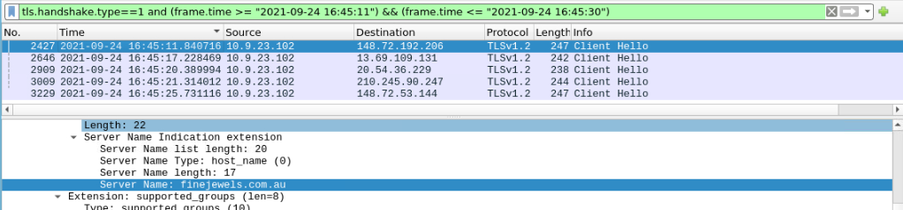

After investigating packets, I found three suspicious domains:

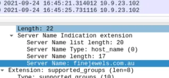
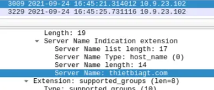
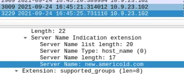

Following the TCP stream, I also found the provider for the SSL certificates on these servers.

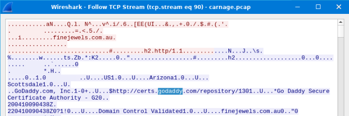

**Information gathered so far:**
- **Timestamp**: 2021-09-24 16:44:38
- **File Downloaded**: Document.zip
- **Domain Host**: attirenepal.com
- **File in the Zip**: chart-1530076591.xls
- **Webserver Used**: LiteSpeed PHP/7.2.34
- **Additional Malicious Connections**: finejewels.com.au, thietbiagt.com, new.americold.com
- **SSL Authority**: GoDaddy

### Cobalt Strike Servers

I was introduced to the term "Cobalt Strike Servers". These servers attack by sending a large amount of traffic, mostly GET and POST requests. I filtered for GET requests and analyzed the frequently accessed IPs.

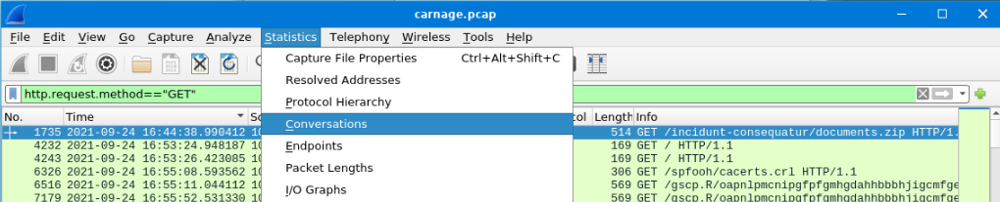

I sorted by IPs and found two IPs flagged in the VirusTotal community page as Cobalt Strike C2 Servers.

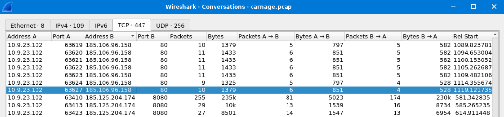
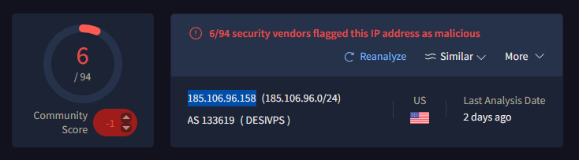
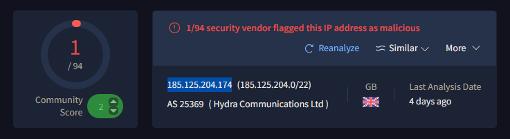
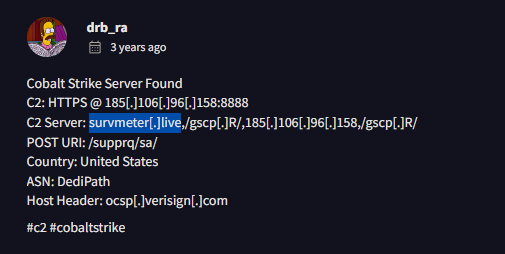
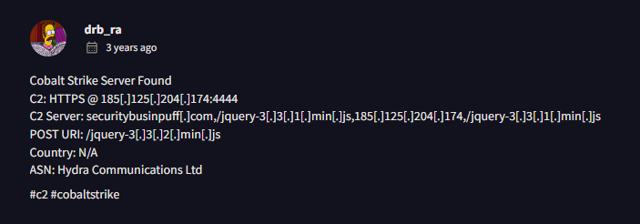

**Recap of information gathered so far:**
- **Timestamp**: 2021-09-24 16:44:38
- **File Downloaded**: Document.zip
- **Domain Host**: attirenepal.com
- **File in the Zip**: chart-1530076591.xls
- **Webserver Used**: LiteSpeed PHP/7.2.34
- **Additional Malicious Connections**: finejewels.com.au, thietbiagt.com, new.americold.com
- **SSL Authority**: GoDaddy
- **Cobalt Strike C2 Server IPs**: 185.106.96.158, 185.125.204.174
- **Server Domains**: survmeter.live, securitybusinpuff.com

### Investigating POST Requests

I filtered for POST requests and followed the TCP stream to see if the victim sent any data.

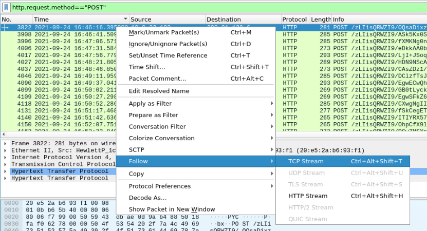

The victim host sent out a lot of packets, as evident from the filter.

We can see the receiver’s domain name and the server header.

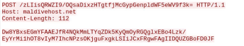
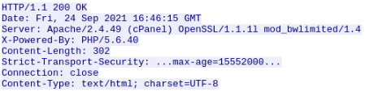

**Another recap of information gathered so far:**
- **Timestamp**: 2021-09-24 16:44:38
- **File Downloaded**: Document.zip
- **Domain Host**: attirenepal.com
- **File in the Zip**: chart-1530076591.xls
- **Webserver Used**: LiteSpeed PHP/7.2.34
- **Additional Malicious Connections**: finejewels.com.au, thietbiagt.com, new.americold.com
- **SSL Authority**: GoDaddy
- **Cobalt Strike C2 Server IPs**: 185.106.96.158, 185.125.204.174
- **Server Domains**: survmeter.live, securitybusinpuff.com
- **POST Infection Domain**: maldivehost.net
- **Server Header**: Apache/2.4.49 (cPanel) OpenSSL/1.1.1l mod_bwlimited/1.4

### API Used by Malware

THM states that an API is used by the malware, so I filtered the log to show frames and DNS that contain “api”.

The results show two API requests. One from MSN (discarded) and one from api.ipify.org (suspicious).

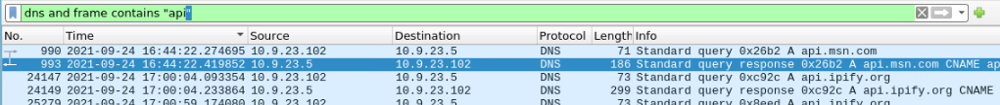

### MalSpam

Finally, THM indicates that malicious spam was sent to the email server from multiple addresses.

I filtered the log with the words “MAIL FROM” to find the suspected emails.

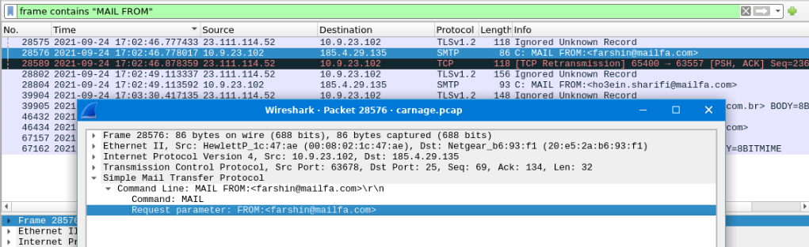

**Final information recap:**
- **Timestamp**: 2021-09-24 16:44:38
- **File Downloaded**: Document.zip
- **Domain Host**: attirenepal.com
- **File in the Zip**: chart-1530076591.xls
- **Webserver Used**: LiteSpeed PHP/7.2.34
- **Additional Malicious Connections**: finejewels.com.au, thietbiagt.com, new.americold.com
- **SSL Authority**: GoDaddy
- **Cobalt Strike C2 Server IPs**: 185.106.96.158, 185.125.204.174
- **Server Domains**: survmeter.live, securitybusinpuff.com
- **POST Infection Domain**: maldivehost.net
- **Server Header**: Apache/2.4.49 (cPanel) OpenSSL/1.1.1l mod_bwlimited/1.4
- **Suspicious API**: api.ipify.org